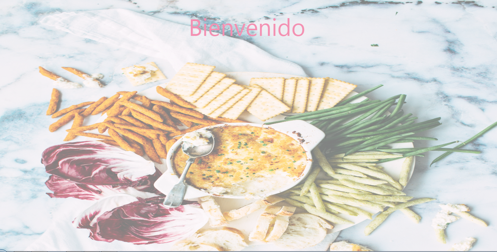
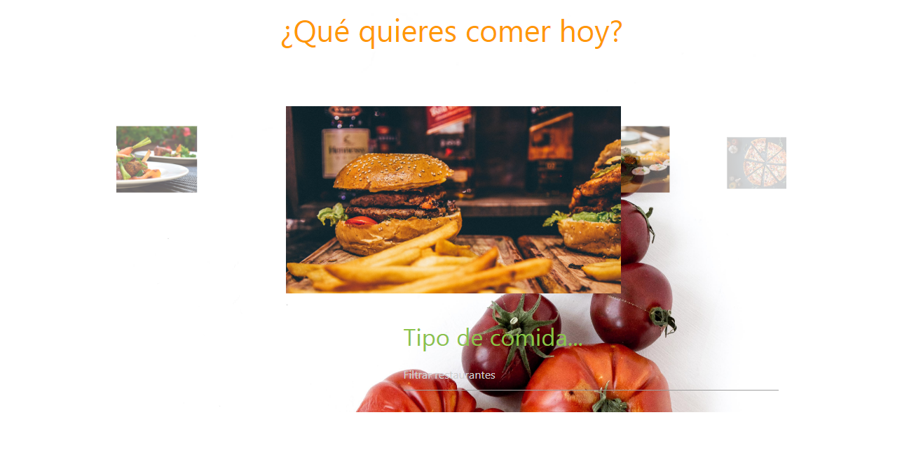
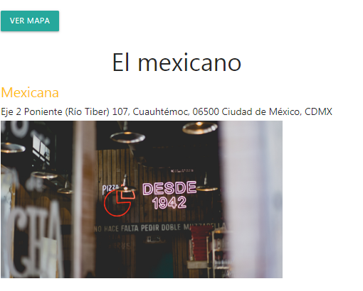
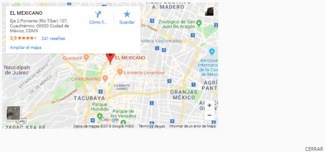

## ¿Que quieres comer hoy? . . .<h2>

Se presenta el diseño, maquetado y funcionalidad, de una aplicación web, que permite que el usuario ingrese el tipo de comida que desea pedir (china, italiana, argentina, japonesa, mexicana y francesa), las cuales fueron ingresadas previamente mediante un formato **JSON.**

Cuando el usuario ingresa cada letra que conforma su petición, se detona un evento **keyup**, el cual mediante comparación de el **JSON** y el dato ingresado, devuelve aquellos que en la "key" asignada como  "food" coincida. Los datos devueltos se reflejan en **HTML** por medio del **DOM** y  **jQuery**.

Finalmente, por cada restaurante regresado como respuesta se genera también un botón que detona un modal, cuya respuesta es el mapa de cada uno de los sitios.

Para ver el sitio completo puedes entrar a: [sitio original](https://indezende.github.io/restaurantFilter/index.html).
